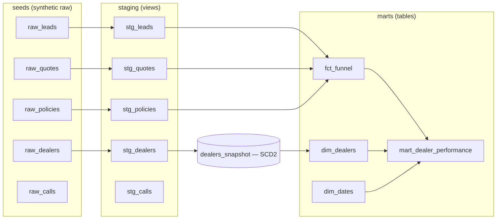

# Dealer Analytics Warehouse

A dbt + DuckDB analytics-engineering project that models an embedded auto-insurance
dealer funnel end to end: from raw events to a tested dimensional model, including a
slowly-changing (SCD2) dealer dimension and documented metric definitions.


> Portfolio project. All data is **synthetic**, generated with a fixed seed
> (`scripts/generate_seed_data.py`), and contains no real customer, dealer, or
> company information.

## What it demonstrates

- **Dimensional modeling** — a star schema with fact and conformed dimension tables
- **Slowly changing dimensions (SCD2)** — dealer history tracked with a dbt snapshot
- **Layered transformations** — clean `staging → marts` lineage with `ref()` throughout
- **Data quality as code** — 29 dbt tests: uniqueness, not-null, relationships,
  accepted values, plus custom singular tests for business rules
- **Metric definitions in one place** — conversion rates defined once, documented in
  the models, so everyone reads the number the same way
- **Reproducible data** — synthetic source data generated in plain Python (stdlib only)

## The domain

Embedded insurance sold through car dealerships. The funnel runs
**calls → leads → quotes → policies**, against a dealer master that carries group,
region, fulfillment carrier, go-live date, and lifecycle status.

## Architecture



## Data model

| Model | Grain | Notes |
|---|---|---|
| `dim_dealers` | one row per dealer **version** | SCD2 from a snapshot; `is_current` flags the live record |
| `dim_dates` | one row per calendar day | built with a DuckDB date spine, no external packages |
| `fct_funnel` | one row per **lead** | `is_quoted` / `is_bound` flags drive all conversion analysis |
| `mart_dealer_performance` | dealer × month | lead→quote→policy rates and bound premium value |

## Quickstart

```bash
git clone https://github.com/bpcrandell/dealer-analytics-warehouse.git
cd dealer-analytics-warehouse
pip install -r requirements.txt

python scripts/generate_seed_data.py   # regenerate seeds (already committed)
dbt build --profiles-dir .             # seeds + snapshot + models + tests
```

Expected result: `Done. PASS=44 WARN=0 ERROR=0`. Then explore it:

```bash
duckdb dealer_warehouse.duckdb
-- e.g. select * from mart_dealer_performance order by leads desc limit 10;
```

## Sample output

Overall funnel from the generated data:

| leads | quotes | policies | lead → policy |
|------:|------:|--------:|:-----------:|
| 6,000 | 3,328 | 1,272 | 21.2% |

## Data quality

Every model is tested. Beyond the generic tests, two singular tests guard business rules:

- `assert_no_policy_without_quote` — every bound policy must trace back to a quote
- `assert_conversion_rate_le_one` — a conversion rate can never exceed 1

## Project structure

```
dealer-analytics-warehouse/
├── scripts/generate_seed_data.py   # synthetic data generator (stdlib only)
├── seeds/                          # raw_*.csv  (the simulated source layer)
├── models/
│   ├── staging/                    # stg_*  (clean + cast, materialized as views)
│   └── marts/                      # dims, facts, and the performance mart
├── snapshots/dealers_snapshot.sql  # SCD2 history for dealers
├── tests/                          # custom singular tests
├── dbt_project.yml
└── profiles.yml                    # DuckDB, self-contained
```

## Built by

**Brandon Crandell** — Analytics Engineer · AI / LLM Application Developer · Full-Stack Data
[LinkedIn](https://www.linkedin.com/in/brandoncrandell)
